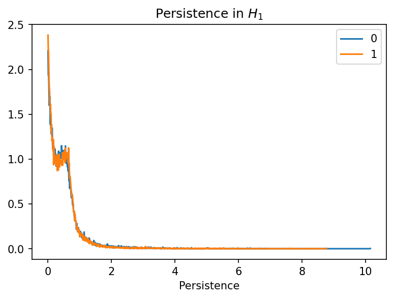
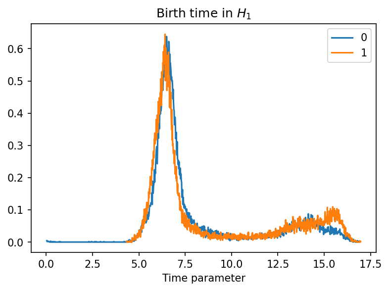
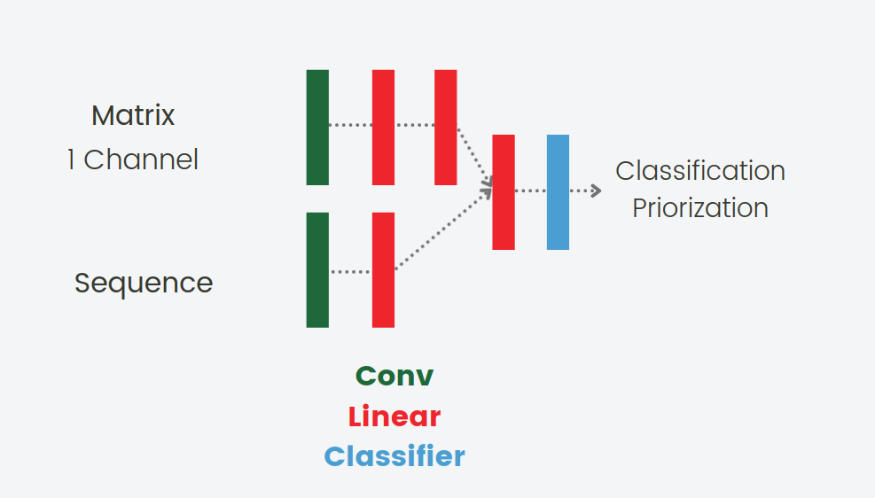

# TO DO LIST
- Tunare le reti (?)
- Uniformare input reti ad solo channel matrix e optional seq
- Schemini genefusion nel ReadMe
- Creazione classe genefusion
- Merge dei vari branch
- Runnare experiments
- Schematizzare i results nel ReadMe
- Spiegare le reti utilizzate nel ReadMe


# 3DOnco - An oncogenic fusion prediction tool (Mari is editing)

<b>The tool is a gene fusion prioritization algorithm for the classification of oncogenic and not oncogenic proteins: starting from 2 chromosomes and their breakpoints the tool simulates the gene fusion and then predicts the nature of the hybrid protein as oncogenic or not through its 3d structure. </b>

<p align="center">
  
</p>

# Table of Contents

- [Data](#Data)
- [Gene Fusion](#Gene)
  - [Theory](#theory)
  - [Class](#class)
- [Protein Structure Prediction](#psp)
  - [HHBlits](#hhblits)
  - [ProSPr](#prospr)
- [Models](#models)
  - [TDA](#tda)
  - [Neural Network](#nn)
  - [Machine Learning](#ml)
- [Results](#results)


---

# Data <a name="Data"></a>


For this purpose we used the data from [DEEPrior](https://github.com/bioinformatics-polito/DEEPrior), which are contained in a tab separated file that for each fusion pair gives:
* Chromosome number of 5p gene
* Breakpoint coordinate of 5p gene
* Chromosome number of 3p gene
* Breakpoint coordinate of 3p gene

The gene fusions of the training set are validated and the label values 1 if the fusion is oncogenic, 0 otherwise. 

The data of the training set are collected from [COSMIC](https://cancer.sanger.ac.uk/cosmic/fusion) (Catalog of Somatic Mutations in Cancer) for Oncogenic gene fusions and [Babicenau et al. work Recurrent chimeric fusion rnas in non-cancer tissues and cells](https://pubmed.ncbi.nlm.nih.gov/26837576/) for not oncogenic ones. Moreover, we have two different datasets to test the model: 

* the Onco gene fusions of the first one are obtained from the ChimerDB2.0 database, while the Not Onco corresponds to the false positives reported by TopHat-Fusion and STAR-Fusion on Illumina BodyMap 2.0 samples; 
* the second test set is composed by oncogenic gene fusions built from the work of [Gao et al. Driver fusions and their implications in the development and treatment of human cancers](https://pubmed.ncbi.nlm.nih.gov/29617662/).

In the figures below, we can see the **distribution** of our data:
- PLOTS DISTRIBUZIONE DATI
- PLOTS DISTRIBUZIONE LUNGHEZZE

# Gene Fusion <a name="Gene"></a>

## Theory <a name="theory"></a>
Gene fusions are specific kind of aberrations that happen when parts of two different genes join together as result of a translocation, interstitial deletion or chromosomal inversion. Fusion proteins resulting from the expression of these hybrid genes may lead to the development of different pathologies, especially cancers: in this case the gene under analysis is defined as 'Oncogene'.

In this scenario, the coordinates of the base pair at which the 2 genes are fused together is called breakpoint, so we refer to the gene BEFORE the break point as <b>5' gene </b> and to the gene AFTER the break point as <b>3' gene </b>.

An eukaryotic transcript is characterised by different areas:

<p align="center">
  
</p>

The ones of interest for our study are the coding DNA sequences (CDS) which are the regions that are transcribed into RNA and then translated into proteins. Moreover, due to the splicing procedure, a single gene can produce multiple different RNAs that are called _transcripts_: for each gene, we consider one single transcript that is the longest one; also, if two transcripts have the same length, then we consider the one with the highest number of coding sequences. 

Building gene fusions sequences requires to consider two important things:
* if we are dealing with the 5' gene (first gene of the fusion) or the 3' gene (second gene of the fusion)
* it the gene transcribes in the + or in the - strand. In this case the - strand must be reversed and the bases must be substituted with their complementaries, since the databases contain only + strand genes.

With 2 genes and 2 signs this leads to 4 different cases: 
<p align="center">
  
</p>

If we consider the 5' gene and it transcribes in the + strand, or the 3' gene that transcribes in the - strand, the portion of the gene that preceeds the breakpoint is selected. On the other hand, if we consider the 5' gene that transcribes in the - strand or the 5+ gene that transcribes in the + strand, we take the portion of the gene that follows the breakpoint. 

Moreover we have to take into account the **position of the breakpoints**: 
* if the break point is inside a **CDS** for both the genes the transcripts are merged together based on the previous rules;
* if the breakpoint is inside an **intron** or inside an **Untranslated Region** (UTR) we need to do further considerations.

We can summarize all the considerations of the second case in the tables below. First, we consider the effects on the 5' gene:

| **Gene**  | **Strand**  |  **BP position**  | **Result**  |
|---|---|---|---|
| 5'  | + | intron  | stop the transcription of this gene at the preceding CDS  |
| 5'  | + | 5' UTR  | take nothing  |
| 5'  | + | 3' UTR  | take complete gene  |
| 5'  | - | intron  | stop the transcription of this gene at the following CDS |
| 5'  | - | 5' UTR  | take complete gene  |
| 5'  | - | 3' UTR  | take nothing  |

Then, we analyze the same situations on the 3' gene:

| **Gene**  | **Strand**  |  **BP position**  | **Result**  |
|---|---|---|---|
| 3'  | + | intron  | start the transcription of this gene at the following CDS  |
| 3'  | + | 5' UTR  | take complete gene  |
| 3'  | + | 3' UTR  | take nothing  |
| 3'  | - | intron  | start the transcription of this gene at the preceding CDS  |
| 3'  | - | 5' UTR  | take nothing  |
| 3'  | - | 3' UTR  | take complete gene  |

Moreover, we can have less frequent situations in which the breakpoint is inside an exon on the first gene and outside on the second gene or viceversa. In these two cases, we can have fusions that retrain a piece of intron because of the loss of acceptor or donor sites in one of the two genes.

## Class <a name="class"></a>
After the review of the theory that underlines gene fusions, we can consider the class created to reconstruct the protein sequences obtained from the fused genes.  

This is the command to run the class:

```
import treDOnco.gene_fusion as gf
gf0= gf.gene_fusion(GRCh_chromosomes_path,out_dir)
gf0.load_tablet(input_path)
gf0.load_data(filter_genome_path)
gf0.fit()
```

### 1. Filter Genome

First we need to filter the human genome. To do so, we implemented `Gene_Fusion.ipynb` that takes as input a gtf file which contains all the annotated human genome. The algorithm filters the data considering the _ensemble_ notation and gives as a result a correspondence one to one between a gene and its transcript. Since one gene can be associated to more than one transcript due to the splicing mechanims, in this case we selected the longest transcript and, in case of equality, the one that contains more CDS.
At the end the results is ordered by chromosomes and stored in a csv file.
The ipynb takes as argument the genome version of the input file coordinates: for semplicity we had already runned the file using GRCH37 and GRCH38. The csv results are inside the folder GRCh, so you don't have to run again this part. For future updatings the time of run is about 20 minutues (di più). GRCH files can be downloaded [here](https://grch37.ensembl.org/info/data/ftp/index.html) and the usage of the function is the following one:


### 2. Gene Fusion

We prepared a function to simulate gene fusion in Gene_fusion_Andre.ipynb.
The script takes as input 2 chromosomes and 2 breakpoints and then simulate the gene fusion. The first pair is associated to the 5' gene and the second one to the 3' gene.
Moreover, in order to run the code we need the gtf files for all the 48 chromosome and the csv file generated in the previous point. You can download the files from LINKS

As input we utilized the fusion pairs provided in DEEPrior. In any case, the file can take as input any csv file formatted as follow: 

| **Chr5p**  | **Coord5p**  |  **5pStrand**  | **Chr3p**  |  **Coord3p**  |  **3pStrand**  | **Label** |
|---|---|---|---|---|---|---|
| 10  | 61665880 | -  | 10  | 43612032 | + | 1 |
| 21  | 42870046 | -  | 7  | 14017105 | - | 1 |
| 15  | 63349294 | +  | 14  | 23887486 | - | 0 |


The function gives as ouput a folder containing a fasta file that represents the protein generated by the fusion. Moreover in the first line of the fasta file is stored:
* The index of the protein and the name of the fusion pair
* The label for the training data: 1 means that the protein is oncogenic, 0 otherwise

And for each gene:
* Chromosome
* Coordinate of the breakpoint
* Name of the gene under analysis
* Sign of transcription
* Shift (It means the module 3 of the length of the transcript)

Also information about the nature of the fusion are stored:
* The sum of the 2 shift 
* The flag is equal to 1 if the fusion produces a end codone before the end of the transcription


Example of output fasta file:

```
>'nome': '1_TMPRSS2_ERG', 'Label': 1, 'Chr5p': '21', 'Coord5p': 42870046, '5pEnsg': 'ENSG00000184012', '5pStrand': '-', 'Chr3p': '21', 'Coord3p': 39795483, '3pEnsg': 'ENSG00000157554', '3pStrand': '-', 'shift_5': 0, 'shift_3': 1, 'shift_tot': 1, 'flag_end_codon': 1

MALNSELS 
```

# Protein Structure Prediction <a name="psp"></a>

<p align="center">
  
</p>

Protein structure prediction is one of the most interesting tasks in bioinformatics field, since interactions among proteins are ruled principally by their own 3d sturcture. The structure of the protein can be analyzed and considered from four different levels: primary, secondary, tertiary and quaternary. 

* The _primary protein structure_ consists of the sequence of amino acids, that are the monomers that constitute proteins.

* The _secondary structure_ is the local folding of the polypeptide chain into alpha helices and beta sheets elements

* The _tertiary structure_ describes the 3D shape of the protein molecule, is composed by a single polypeptide chain backbone with one or more secondary structures and reveals very important functional and chemical properties of the protein 

* The _quaternary structure_ is the association of several protein chains. 

In this context, we make use of a folding algorithm that exploits deep neural networks techniques to predict the protein tertiary structure from its amino acid sequence. 

These types of algorithm need as input the protein profile instaed of the sequence of amino acid, for this reason before applying the folding algorithm we need to perform some alignement tecniques.

## HHBlits <a name="hhblits"></a>

We start from the amino acid sequences extracted from the FASTA files obtained as a result of the gene fusion step. The second step is to generate alignments using the tool HHBlits from [HHSuite](https://bmcbioinformatics.biomedcentral.com/articles/10.1186/s12859-019-3019-7). Since it is difficult to predict funcions or structures only by the amino acid sequence, this must be compared with sequences of other proteins in public database (usually these proteins are associated to simpler living species). If a protein is found similar to another one in the database it is said that they are homologous or evolutionally related. (WIKIPEDIA), so probabbly they share structure and function!

One of the main processes in computational biology consists of building protein **multiple-sequence alignments** ([MSAs](https://en.wikipedia.org/wiki/Multiple_sequence_alignment)) since MSAs are a key intermediate step in the prediction of protein tertiary structure. MSA refers to a sequence alignment of more than two sequences from which sequence homology can be inferred. 

HHBlits is one of the most important tools to generate multiple sequence alignments. The starting point is to convert the sequences to a condensed representation of a MSA called **profile hidden Markov model** ([HMM](https://en.wikipedia.org/wiki/Hidden_Markov_model)). HMMs are similar to sequence profiles, in the sense that they transform MSA into _position-specific scoring systems_: profile-profile comparison methods are preferred to sequence-sequence comparison since profiles give much more information than the simple sequence and they are more powerful.  In sequence profiles, each of the 20 amino acids is assigned with a score for each position in the query sequence: this score corresponds to its frequency in that position in the original alignment. These frequencies can be interpreted as probabilities of seen that amino acid in new related proteins. Profile HMM provide, in addition to the amino acid frequencies, also information about the frequencies of insertions and deletions at each column.

After creating the HMM, the HHBlits server iteratively searches through an HMM database - in our case, UniProt30: it looks for the sequences with an expected value ([_E_ value](http://www.biocomp.unibo.it/casadio/LMBIOTEC/evalue)) below a certain threshold and it adds them to the query MSA, from which the HMM for the next search iteration is built. 


HHBlits is a very fast and sensitive algorithm thanks to a two-stage prefilter phase that reduces the number of database HMMs to be aligned. 

As a result it produces an .a3m file that contains the HMM for the sequence and a .hhr file for the details.

HHBlits was runned on [HPC Polito](https://hpc.polito.it/).

Example of the usage of the tool: 

``` 
hhblits -cpu 2 -i ${TARGET_SEQ}.fa -d Project/database/uniclust30_2018_08/uniclust30_2018_08 -oa3m ${TARGET_SEQ}.a3m -ohhm ${TARGET_SEQ}.hhm -n 3 
```

## ProSPr : Democratized Implementation of Alphafold Protein Distance Prediction Network <a name="prospr"></a>

Deep mind's folding algorithm code for [Alphafold](https://deepmind.com/blog/article/alphafold-a-solution-to-a-50-year-old-grand-challenge-in-biology) is still not available but [ProSPr](https://www.biorxiv.org/content/10.1101/830273v1) enbles us to exploit ..., so we are able to retrieve the distance matrix from each sequence.

<p align="center">
  
</p>

The matrix represents the probability that amino acid i and j is less than a certain treshold.

In addition alphafold exploits these information together with a folding algorithm (like [Rosetta](https://boinc.bakerlab.org/)) that takes into account electostatic forces, vand der Waals interaction and so on. 

But due to our computational limit we decided to limit our analysis to the study of the distance matrix.

Besides of the distance predictions, ProSPr algorithm also gives as a result some auxiliary predictions which are the secondary structure and the torsion angles. Proteins’ **secondary structure** determines structural states of local segments of amino acid residues in the protein. The prediction of the secondary structure can be distinguished between 3-state and 8-state predictions. The first kind takes into account three types of secondary structures: alpha helix ('H'), beta-strand ('E') and coil region ('C') which is an irregular state. In this work the DSSP notation is considered that subdivides the previous states in further categories giving rise to eight possible types of secondary structures. Another state is added to represent missing data, for instance the case in which there are no residues in that part of the structure. 

For what concerns the torsion angles, the conformation of the backbone of a peptide chain is determined by the values of the phi and psi angles, which are defined respectively by the rotation around the bond from the alpha carbon to nitrogen and from the alpha carbon to the carbonyl. These angles are discretized into 36 bins from 180° to 180°, so bin includes 10°. Also in this case, another bin is added to take into account gaps.

The algorithm takes as input an a3m file containing the protein profile and gives as output a pkl file with the following keys:
* Domain: file path
* Sequence: Primary structure
* Secondary structure: array of size (9, len_seq) that contains the probability that one aa is part of a secondary structure using [DSSP](https://en.wikipedia.org/wiki/DSSP_(hydrogen_bond_estimation_algorithm)) notation 
* [Phi angle](https://proteopedia.org/wiki/index.php/Phi_and_Psi_Angles) : phi angles array of size (37, len_seq)
* [Psi angle](https://proteopedia.org/wiki/index.php/Phi_and_Psi_Angles) : psi angles between of size (37, len_seq)
* Accessible Surface Area ([ASA](https://en.wikipedia.org/wiki/Accessible_surface_area))
* Network: subdivision of the protein into smaller chunck to be maneged by the model: description for the prediction task parameters
* Description

And it contains the distance probability matrix in the form:
* Distance distribution bins map: list of bins of distance
* Distance distribution: array with dimension (seq, seq, dist_bin), that indicates the probability that each pair of residues has a distance within the range of the bin _i_, considering ten different bins. 

In the following the code to plot the distance matrix:

```
pkl = np.load("/content/drive/MyDrive/Pickle_Test/2_ATF1_EWSR1_prediction.pkl", allow_pickle=True)
pkl.keys()
dist = pkl['dist'].sum(axis=0)
distbin = np.zeros_like(pkl['dist'][0])
for i in range(10):
  distbin += pkl['dist_bin_map'][i]*pkl['dist'][i]

fig, ax = plt.subplots(figsize=(8,8))
sns.heatmap(distbin,cmap=sns.color_palette("Blues_r", as_cmap=True))
plt.show()
```

The algorithm is basically divided into 3 main blocks:

<p align="center">
  
</p>

* In the first part the alignment results produced with HHBlits are then used to fit a statistical model called Direct-Coupling Analysis ([DCA](https://arxiv.org/pdf/1801.04184.pdf)), in this case indicated with Potts model. [The model aims to find a probability for each sequence that can be interpreted as the probability that the sequence in question belongs to the same class of sequences as the ones in the MSA](https://en.wikipedia.org/wiki/Direct_coupling_analysis).

<p align="center">
  
</p>

It should be computed by exploting maximum likehood estimation (ie find the sequnce of aa that maximes the probability) but since it is a computationally complex task usually it is derived by inference. 
* In the second one there is the network which is composed by a RESNET and some convolutionl layers.
* In the third one there is an overview of the transformation for the input vector

Now we are exlploiting an [updated version](https://github.com/dellacortelab/prospr) of the code, but the main composition is still the same.

In particular, in this version the DCA analysis is substituted with a simpler one based on covariance matrix that reduces the computational time called for simplicity ['fast DCA'](https://direct.mit.edu/neco/article/29/11/3040/8328/Sparse-Covariance-Matrix-Estimation-by-DCA-Based).

On average a protein to complete the HHBlist and Propspr takes 3 hours.

# Models <a name="models"></a>
Now that we have the distance prediction matrices, we want to be sure that they contains significant pattern that allow us to distinguish between oncogenic and not oncogenic fusions. 
## Topological Data Analysis  <a name="tda"></a>
We can interpret the distance prediction matrices as weight matrices referred to a graph, where the nodes represent the residues and the weights represent the predicted distances between each pair of aminoacids. Using this network structure, we can exploit algebraic topology and topological data analysis to obtain some insights about the properties of these matrices. 

Topological data analysis is a very important tool based on simplicial complexes, which are a generalization of the concept of graph and are objects built from points, edges, triangular faces, etc. One of the main application of TDA is simplicial homology, also known as the _theory of holes_, since in simple words its goal is to detect similarities or differences between two objects (simplicial complexes) by analyzing the connected components or holes or voids in their topological structures. 

In particular, we study **persistent homology** which is an algebraic method for discerning topological features of data. The idea is that we can consider a point cloud and connect nearby points to construct simplicial complexes. The points are considered near if they are at a distance less than a parameter _d_ and as a result we obtain that we can build simplicial complexes when points start to be linked by edges: for instance, if we have three points pairwise connected we can fill the space among them to build a triangle. At this point, we can use homology to detect holes, but of course the algorithm is strongly affected by the value of the chosen distance. For this reason, we consider all the values of the parameter _d_ observing that hole appears at a particular value and disappears at another value because the space is filled and simplicial complexes are built. Persistent homology has the goal to detect the birth and the death time of each connected component or hole or void in the simplicial complex. 

Persistent homology can be visualized by means of a persistence diagram that is obtained by plotting on the plane that has on the _x_ axis the birth measure and on the _y_ axis the death measure all the points recorded. 

Performing this experiment in our case using the distance matrices, we compute some statistics on the persistence diagrams obtained. In particular, we compute the distribution of the persistences by computing the differences between the death and the birth for each point and the distribution of the birth for each point. In the end, we obtain the following distributions:

<p align="center">
  
</p>

<p align="center">
  
</p>

We can notice that the plots do not give us clear insights about differences in the two distributions. Nevertheless, we try to perform a **Kolmogorov-Smirnov test** to quantify the distance between the two distributions. 

|**distribution**|**p-value**|
|---|---|
|persistence|10^(-16)|
|birth|10^(-29)|

The small p-value indicates that we can reject the null hypothesis that the distributions of the two samples are the same meaning that the topological analysis give us insights about the differences between the topological features of the distance matrices associated to the onco and not onco fusions respectively.

## Classifiers algorithms
After the first statistical analysis, we proceed with the application of machine learning and deep learning algorithms. We fed the models with two types of input:
* distance matrix: the 10 channel matrix is transformed into a 1 channel matrix, exploiting the code used for visualization purposes;
* protein sequence: we transform the sequences using two kinds of encodings: 
  - **One-hot encoding**: the sequence is transformed into a matrix of dimension (len_seq, n_amino) where the i-th letter is encoded by a vector of all zeros, except for the j-th element associated with the aminoacid which is set to 1;
    <p align="center">
      
    </p>
  - **Word2Vec encoding**:  Word2Vec is an encoding typical of Natural Language Processing. Following the example of [ProtVec](https://arxiv.org/ftp/arxiv/papers/1503/1503.05140.pdf), each sequence is broken into trigrams that are then used to train the algorithm. In particular, Word2Vec is a one layer neural network that takes in input one trigram and gives as output the probability of each of the other ones to be near the target. The hidden layer is 100, and it represents the features we are using. So at the end each sequence will be represented by a vector of 100 elements that is the sum of all the arrays of its trigrams.

Before applying the encoding, in order to have as input sequences of the same size, we first perform two operations: **padding** and **cropping**. We decide to obtain as outputs sequences of size equals 1000, so shorter sequences are padded adding at the end a negative value; on the other hand, longer sequences are cropped starting from a random position.
 
## Neural Network <a name="nn"></a>
We first tried to use a convolutional network neural network (CNN) which is an architecture thta can exploit well the sequential nature of our data.

Our CNN has two modalities 
* only matrix
* matrix plus sequence, in this case we only used the one hot encoding version of sequence data.

<p align="center">
      
</p>

The model consists in two separate streams that converge into a single linear layer and softmax to perform the classification and gives as output a probability over two classes and the classification is done selecting the class with greather value.
Each stream cosists in a convolutional layer with maxpool and a linear layer. The matrix branch has two consecutive linear layer and before the second one we linearize the matrix, both branches have the same dimentions and in the end they are summed over and passed to the classifier layer. The model presents batch normalization and dropout at the begging and at the end.
We recall that the sequence branch is optional, and the model works fine with only the matrix data.

The model can be customize with different starting hidden layer dimention. The dimention of the network expands untili it reaches the cassifier that compress the rappresentation before appling a softmax fuction.


## Machine Learning  <a name="ml"></a>
After our attempt with deep learning, we tried to apply Machine Learning techniques both on the protein sequences and on the distance matrix flattened. For the protein sequences, we performed two types of encoding in order to give a proper input to the classifiers.

### 1. Random Forest <a name="rf"></a>
Random forest is an ensemble machine learning technique that can be exploited both for classification and regression.
The algorithm consists in many decision trees that predict indipendently and then vote for the result.
<p align="center">
  
</p>

We finetuned the hyperparameters of the algorithm using grid search cross validation with 10 folds and the following set of hyperparameters choices:

```
'criterion': ["gini", "entropy"]
'max_features': ["auto", "sqrt", "log2"]
'random_state': [1]
'bootstrap': [True, False]
```

### 2. SVM <a name="svm"></a>
Support Vector Machine is a supervised algorithm that aims at finding the best hyperplane that separates the training data and maximizes the margin, which is the distance between the hyperplane and the closest points from any class called support vectors. It can be used in linear and non-linear classification tasks: in this last case, the kernel trick is exploited to map the data into a higher dimensional space where the classes are linearly separable. However, for computational reasons we just use the linear version of the algorithm.

<p align="center">
  
</p>

We finetuned the hyperparameters of the algorithm using grid search cross validation with 10 folds and the following set of hyperparameters choices:

 ```
'C' : [ 0.1, 1, 10, 1000]
```

# Results <a name="results"></a>
## Accuracy <a name="results"></a>

Results are summarized in the table below. 

As we can see, the performances increase a lot when the matrix is converted into only one channel. This means that the pattern under analysis can be visualized as an image.

 Moreover, experiments are performed using as input or the matrix or the sequence. Due to computational limit, we were able to consider only 1000 matrix. In fact, the accuracy scores for the cases in which we are utilizing the matrix it is lower than the ones considering just the sequences.
This might be due also to the error propagation trough the networks that is generated by the alignment and the distance matrix.


## Conclusion <a name="results"></a>

We can see that the 3d strcuture does not lead to a significant improving of the performance of the algorithm. In fact, as states in [Anfinsen's dogma](https://en.wikipedia.org/wiki/Anfinsen%27s_dogma) (sto esagerando?) the strcuture of a protein (at least for the littlest ones) is determined only by its amino acid sequence.
In this sense, retriving the 3d structure does not add information (???) che sto dicendo, ha senso ?
Besides, using all these tools to reacreating the 3d strcuture we are propagating error throgh the difefrent algorithm, and in this sense we are .... the data . AIUTO


