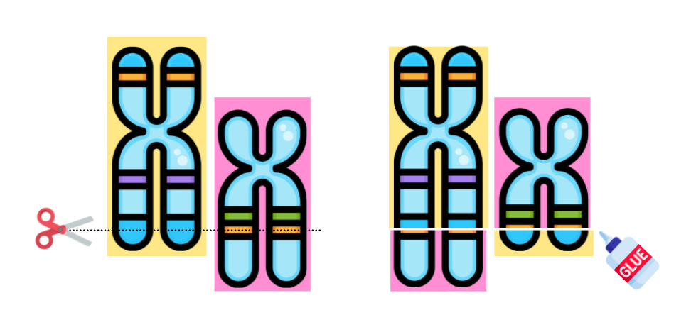
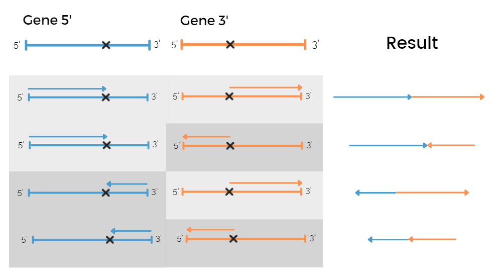
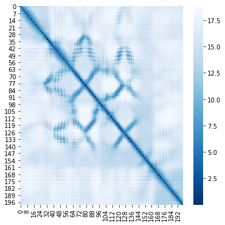
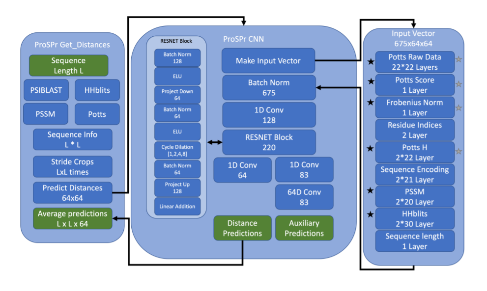
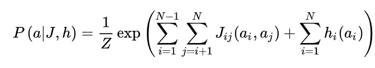
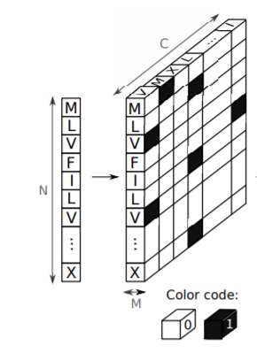

# TO DO LIST
- Tunare le reti (?)
- Uniformare input reti ad solo channel matrix e optional seq
- Schemini genefusion nel ReadMe
- Creazione classe genefusion
- Merge dei vari branch
- Runnare experiments
- Schematizzare i results nel ReadMe
- Spiegare le reti utilizzate nel ReadMe


# 3DOnco - An oncogenic fusion prediction tool (Mari is editing)

<b>The tool is a gene fusion classification algorithm for onco and not onco proteins: starting from 2 chromosomes and their break-points the tool simulates the gene fusion and then predicts the nature of the hybrid protein as oncogenic or not (non è il gene che è oncogenic?) through its 3d structure. </b>

<p align="center">
  
</p>

# Table of Contents

- [Data](#Data)
- [Gene Fusion](#Gene)
  - [Theory](#theory)
  - [Class](#class)
- [Protein Structure Prediction](#psp)
  - [HHBlits](#hhblits)
  - [ProSPr](#prospr)
- [Models](#models)
  - [Neural Network](#nn)
  - [Random Forest](#rf)
- [Results](#results)


---

# Data <a name="Data"></a>


For this purpose we used data from [DEEPrior](https://github.com/bioinformatics-polito/DEEPrior), which are contain in a csv file that for each fusion pair contain:
* Name of the fusion pair
* Label 1 if oncogenic, 0 otherwise 
* 5' Gene and break point
* 3' Gene and break point

That are collected from [COSMIC](https://cancer.sanger.ac.uk/cosmic/fusion) (Catalog of Somatic Mutations in Cancer) for Oncogenic gene fusions and [Babicenau et al. work Recurrent chimeric fusion rnas in non-cancer tissues and cells](https://pubmed.ncbi.nlm.nih.gov/26837576/) for not oncogenic ones.

Conta quanti sono per classe 

Mettiamo la distribuzione delle lunghezze ?
# Gene Fusion <a name="Gene"></a>

## Theory <a name="theory"></a>
Gene fusions are specific kind of aberrations that happen when parts of two different genes join together as result of a translocation, interstitial deletion or chromosomal inversion. Fusion proteins resulting from the expression of these hybrid genes may lead to the development of different pathologies, especially cancers: in this case the gene under analysis is defined as 'Oncogene'.

In this scenario, the coordinates of the base pair at which the 2 genes are fused together is called breakpoint, so we refer to the gene BEFORE the break point as <b>5' gene </b> and to the gene AFTER the break point as <b>3' gene </b>.

An eukaryotic transcript is characterised by different areas:

<p align="center">
  
</p>


the ones of interest for our study are the coding DNA sequences (CDS) which are the regions that are transcribed into RNA and translated into proteins. Moreover, a single gene can produce multiple different RNAs due to splicig procedure (?) that are called _transcripts_ and, for each gene, we consider one single transcript that is the longest one; also, if two transcripts have the same length, than we consider the one with the highest number of coding sequences. 

Building gene fusions sequences requires to consider two important things:
* if we are dealing with the 5' gene (first gene of the fusion) or the 3' gene (second gene of the fusion)
* it the gene transcribes in the + or in the - strand. In this case the - strand must be reversed and the bases must be substituted with their complementaries, since the databases contain only + strand genes.

With 2 genes and 2 signs this leads to 4 different cases: 
<p align="center">
  
</p>

If we consider the 5' gene and it transcribes in the + strand, or the 3' gene that transcribes in the - strand, the portion of the gene that preceeds the breakpoint is selected. 

On the other hand, if we consier the 5' gene that transcribes in the - strand or the 5+ gene that transcribes in the + strand, we take the portion of the gene that follows the breakpoint. 

Moreover we have to take into account the position of the break points. 

If the break point is inside a CDS for both the genes the transcripts are merged together based on the previous rules.

But we need to be more carefull if the break point is inside an intron or inside an Untranslated Region (UTR)

<b>5' gene transcribes with + sign:</b>

* bp into an exon we should stop the transcription of this gene at the preceding CDS.

* bp into 5' UTR --> Nothing
* bp into 3' UTR --> Complete gene

<b>5' gene transcribes with - sign:</b>

* bp into an exon we should stop the transcription of this gene at the following CDS. (perchè stiamo sempre leggendo sul + strand)

* bp into 5' UTR --> Complete gene
* bp into 3' UTR --> Nothing

<b>3' gene transcribes with + sign:</b> 

* bp into an exon we should start the transcription of this gene at the following CDS.
* bp into 5' UTR --> Complete Gene
* bp into 3' UTR --> Nothing

<b>3' gene transcribes with - sign:</b>

* bp into an exon we should start the transcription of this gene at the preceding CDS. (perchè stiamo sempre leggendo sul + strand)
* bp into 5' UTR --> Nothing
* bp into 3' UTR --> Complete Gene


## FUNCTION

(Implemented on Colab gli diamo qualche specifica?)

## Filter Genome


Firstly we need to filter the human genome, to do so we implemented `Gene_Fusion.ipyn` that takes in input a gtf file which contains all the genome annotated. The algorithm filter the data considering the ensembl notation and gives as result a correspondence one to one between a gene and its transcript. Since one gene can be associated to more tha one transcript due to splicing mechanims in this case we selected the transcript that contains more CDS.
At the end the results is ordered by chromosomes and stored in a csv.
The ipyn takes as input argument the version of the annotation, for semplicity we had already runned the file using GRCH37 and GRCH38. The csv results are inside the folder (NON LO SO), so you don't have to run again this part. For future updatings the time of run is about 20 minutues (di più). GRCH files can be downloaded [here](https://grch37.ensembl.org/info/data/ftp/index.html)

ESEMPIO PER GLI SCEMI ---> ADELA

## Gene Fusion


We prepared a function to simulate gene fusion in Gene_fusion_Andre.ipyn.
The script takes as input 2 chromosome and 2 break points and then simulate the gene fusion. The first pair is associated to the 5' gene and the second one to the 3' gene.
Moreover, the code to run need the gtf files for all the 48 chromosome and the csv file generated in the previous point. You can download the files from LINKS

As input we utilized the fusion pairs provided in DEEPrior. In any case, the file can take as input any csv file formatted as follow: 

<table>

  <tr>
    <td>Chr5p</td>
    <td>Coord5p</td>
    <td>5pStrand</td>
    <td>Chr3p</td>
    <td>Coord3p</td>
    <td>3pStrand</td>
    <td>Label</td>
  </tr>
</table>

The function gives as ouput a a folder containing a fasta file that represents the protein generated by the fusion. Moreover in the first line of the fasta file is strored:
* The index of the protein and the name of the fusion pair
* The label 1 means that the protein is oncogenic, 0 otherwise

And for each gene:
* Chromosome
* Coordinate of the break point
* Name of gene under analysis
* Sign of transcription
* Shift (It means the module 3 of the length of the transcript)

Also information about the nature of the fusion are stored:
* The sum of the 2 shift 
* The flag is equal to 1 if the fusion produces a end codone before the end of the transcription


Example of output fasta file:

```
>'nome': '1_TMPRSS2_ERG', 'Label': 1, 'Chr5p': '21', 'Coord5p': 42870046, '5pEnsg': 'ENSG00000184012', '5pStrand': '-', 'Chr3p': '21', 'Coord3p': 39795483, '3pEnsg': 'ENSG00000157554', '3pStrand': '-', 'shift_5': 0, 'shift_3': 1, 'shift_tot': 1, 'flag_end_codon': 1

MALNSELS 
```


# Protein Structure Prediction <a name="psp"></a>

<p align="center">
  
</p>

Protein structure prediction is one of the most interesting tasks in bioinformatics field, since interactions among proteins are ruled principally by their own 3d sturcture. The structure of the protein can be analyzed and considered from four different levels: primary, secondary, tertiary and quaternary. 

* The _primary protein structure_ consists of the sequence of amino acids, that are the monomers that constitute proteins.

* The _secondary structure_ is the local folding of the polypeptide chain into alpha helices and beta sheets elements

* The _tertiary structure_ describes the 3D shape of the protein molecule, is composed by a single polypeptide chain backbone with one or more secondary structures and reveals very important functional and chemical properties of the protein 

* The _quaternary structure_ is the association of several protein chains. 

In this context, we make use of a folding algorithm that exploits deep neural networks techniques to predict the protein tertiary structure from its amino acid sequence. 

These types of algorithm need as input the protein profile instaed of the sequence of amino acid, for this reason before applying the folding algorithm we need to perform some alignement tecniques.

## HHBlits <a name="hhblits"></a>

We start from the amino acid sequences extracted from the FASTA files obtained as a result of the gene fusion step. The second step is to generate alignments using the tool HHBlits from [HHSuite](https://bmcbioinformatics.biomedcentral.com/articles/10.1186/s12859-019-3019-7). Since it is difficult to predict funcions or structures only by the amino acid sequence, this must be compared with sequences of other proteins in public database (usually these proteins are associated to simpler living species). If a protein is found similar to another one in the database it is said that they are homologous or evolutionally related. (WIKIPEDIA), so probabbly they share structure and function!

One of the main processes in computational biology consists of building protein **multiple-sequence alignments** ([MSAs](https://en.wikipedia.org/wiki/Multiple_sequence_alignment)) since MSAs are a key intermediate step in the prediction of protein tertiary structure. MSA refers to a sequence alignment of more than two sequences from which sequence homology can be inferred. 

HHBlits is one of the most important tools to generate multiple sequence alignments. The starting point is to convert the sequences to a condensed representation of a MSA called **profile hidden Markov model** ([HMM](https://en.wikipedia.org/wiki/Hidden_Markov_model)). HMMs are similar to sequence profiles, in the sense that they transform MSA into _position-specific scoring systems_: profile-profile comparison methods are preferred to sequence-sequence comparison since profiles give much more information than the simple sequence and they are more powerful.  In sequence profiles, each of the 20 amino acids is assigned with a score for each position in the query sequence: this score corresponds to its frequency in that position in the original alignment. These frequencies can be interpreted as probabilities of seen that amino acid in new related proteins. Profile HMM provide, in addition to the amino acid frequencies, also information about the frequencies of insertions and deletions at each column.

After creating the HMM, the HHBlits server iteratively searches through an HMM database - in our case, UniProt30: it looks for the sequences with an expected value ([_E_ value](http://www.biocomp.unibo.it/casadio/LMBIOTEC/evalue)) below a certain threshold and it adds them to the query MSA, from which the HMM for the next search iteration is built. 


HHBlits is a very fast and sensitive algorithm thanks to a two-stage prefilter phase that reduces the number of database HMMs to be aligned. 

As result it produces an .a3m file that contains the HMM for the sequence and a .hhr file for the details.

HHBlits was runned on [HPC Polito](https://hpc.polito.it/) using .... (le farei capire che non è stato bello)

Example: 

``` 
hhblits -cpu 2 -i ${TARGET_SEQ}.fa -d Project/database/uniclust30_2018_08/uniclust30_2018_08 -oa3m ${TARGET_SEQ}.a3m -ohhm ${TARGET_SEQ}.hhm -n 3 
```

## ProSPr : Democratized Implementation of Alphafold Protein Distance Prediction Network <a name="prospr"></a>

Deep mind's folding algorithm code for [Alphafold](https://deepmind.com/blog/article/alphafold-a-solution-to-a-50-year-old-grand-challenge-in-biology) is still not available but [ProSPr](https://www.biorxiv.org/content/10.1101/830273v1) enbles us to exploit ..., so we are able to retrive the distance matrix from each sequence.

<center></center>

The matrix represents the probability that amino acid i and j is less than a certain treshold.

In addition alphafold exploits these information togetehr with a folding algirthm (like [Rosetta](https://boinc.bakerlab.org/)) that takes into account electostatic forces, vand der Waals interaction and so on (MARINA HELP). 

But due to our computational limit we decided to limit our analysis to the study of the distance matrix.

The algorithm takes as input an a3m file containing the protein profile and gives as output a pkl file with the following keys:
* Domain: path del file
* Sequence: Primary structure
* Secondary strcuture: array that contains the probability that one aa is part of a secondary structure using [DSSP](https://en.wikipedia.org/wiki/DSSP_(hydrogen_bond_estimation_algorithm)) notation
* [Phi angle](https://proteopedia.org/wiki/index.php/Phi_and_Psi_Angles) : torsion angle between alpha carbon
* [Psi angle](https://proteopedia.org/wiki/index.php/Phi_and_Psi_Angles) : tosion angle between beta carbon
* Accessible Surface Area ([ASA](https://en.wikipedia.org/wiki/Accessible_surface_area))
* Network: subdivision of the protein into smaller chunck to be maneged by the model: description for the prediction task parameters
* Description

And it contains the distance probability matrix in the form:
* Distribution: array with dimension (seq, seq, dist_bin), it means that 
* Distribution bins map: list of bins of distance

In the following the code to plot the distance matrix:

```
pkl = np.load("/content/drive/MyDrive/Pickle_Test/2_ATF1_EWSR1_prediction.pkl", allow_pickle=True)
pkl.keys()
dist = pkl['dist'].sum(axis=0)
distbin = np.zeros_like(pkl['dist'][0])
for i in range(10):
  distbin += pkl['dist_bin_map'][i]*pkl['dist'][i]

fig, ax = plt.subplots(figsize=(8,8))
sns.heatmap(distbin,cmap=sns.color_palette("Blues_r", as_cmap=True))
plt.show()
```

The algorithm is basically divided into 3 main blocks:

<p align="center">
  
</p>

*In the first part the alignment results produced with HHBlits are then used to fit a statistical model called Direct-Coupling Analysis ([DCA](https://arxiv.org/pdf/1801.04184.pdf)), in this case indicates with Potts model. [The model aims to find a probability for each sequence that can be interpreted as the probability that the sequence in question belongs to the same class of sequences as the ones in the MSA](https://en.wikipedia.org/wiki/Direct_coupling_analysis).

<p align="center">
  
</p>

It should be computed by exploting maximum likehood estimation (ie find the sequnce of aa that maximes the probability) but since it is a computationally complex task usually it is derived by inference. 
*In the second one is the network which is composed by a RESNET and some convolutionl layers.
*In the third one is an overview of the transformation for the input vector

Now we are exlploiting and [updated version](https://github.com/dellacortelab/prospr) of the code, but the main composition is still the same.

In particular, in this version the DCA analysis is substituted with a simpler one based on covariance matrix that reduces the computational time called for simplicity ['fast DCA'](https://direct.mit.edu/neco/article/29/11/3040/8328/Sparse-Covariance-Matrix-Estimation-by-DCA-Based).


On average a protein to complete the HHBlist and Propspr takes 3 hours
# TDA <a name="tda"></a>
Now that we have the matrix, we want to be sure that they contains significant pattern for the classification.
# Models <a name="models"></a>
## Neural Network <a name="nn"></a>
Rete CONV
LSTM
UNA BELLA FIGURA DELLA RETE ???????????????????????????????? 
a 10 e 1 canale
## Random Forest <a name="rf"></a>
Random forest is a an ensemble machine learning technique that can be exploited both for classification and regression.
The algorithm consists in many decision trees that predict indipendently and then vote for the result.
<p align="center">
  
</p>

### Matrix analysis
For semplicity we transform the 10 channels matrix into a 1 channel matrix, exploiting the code used for visualize it. 

Furthermore, the standard preprocessing is applied so sequences are elongated or cropped in order to achieve the same length of 1000 aa. (lo spieghiamo su)


Then the script takes in input the matrix and ,after vectorizing it, perform a gridsearch CV with these parameters:
```
'criterion': ["gini", "entropy"]
'max_features': ["auto", "sqrt", "log2"]
'random_state': [1]
'bootstrap': [True, False]
```
### Sequence analysis

The same procedure is now proposed using just the protein sequence, so we can see if passing through the 3d structure has lead to an improving of the performances.

Firsly we need to encode the sequences into a [one hot encoding form](https://pdfs.semanticscholar.org/8aeb/ecf42891c94bdddd4eabb1ad5ae0e6700281.pdf?_ga=2.171528992.1835270510.1626557090-1170679748.1626189564).

<p align="center">
  
</p>

Then we finetuning the algorithm in the same way.
# Results <a name="results"></a>
## Accuracy <a name="results"></a>

Using only the distance matrix and tuning the random forest we achieved an accuracy score of: XXXXXXXXXX

Instead, using only the amino acid sequence we achieved: XXXXXXXXXXXXX


## Conclusion <a name="results"></a>

We can see that the 3d strcuture does not lead to a significant improving of the performance of the algorithm. In fact, as states in [Anfinsen's dogma](https://en.wikipedia.org/wiki/Anfinsen%27s_dogma) (sto esagerando?) the strcuture of a protein (at least for the littlest ones) is determined only by its amino acid sequence.
In this sense, retriving the 3d structure does not add information (???) che sto dicendo, ha senso ?
Besides, using all these tools to reacreating the 3d strcuture we are propagating error throgh the difefrent algorithm, and in this sense we are .... the data . AIUTO


